# Курсовая работа "Отказоустойчивая инфраструктура в Yandex Cloud" - Лисогор Александр Олегович

## **Сайт**
Разработана и развернута отказоустойчивая инфраструктура для веб-сайта в Yandex Cloud с использованием Terraform и Ansible. Созданы две идентичные виртуальные машины с nginx в разных зонах доступности, объединенные в Target Group и Backend Group с настройкой health checks. Настроен Application Load Balancer с HTTP router для распределения трафика между веб-серверами. Реализован listener на порту 80 с автоматической маршрутизацией запросов.

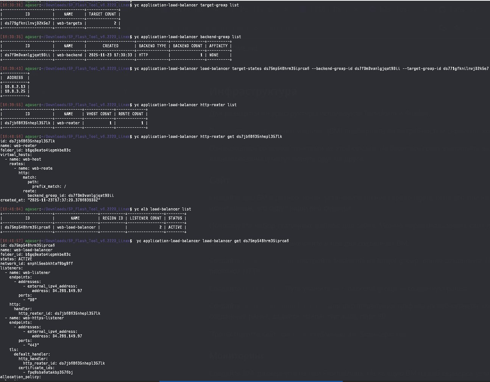

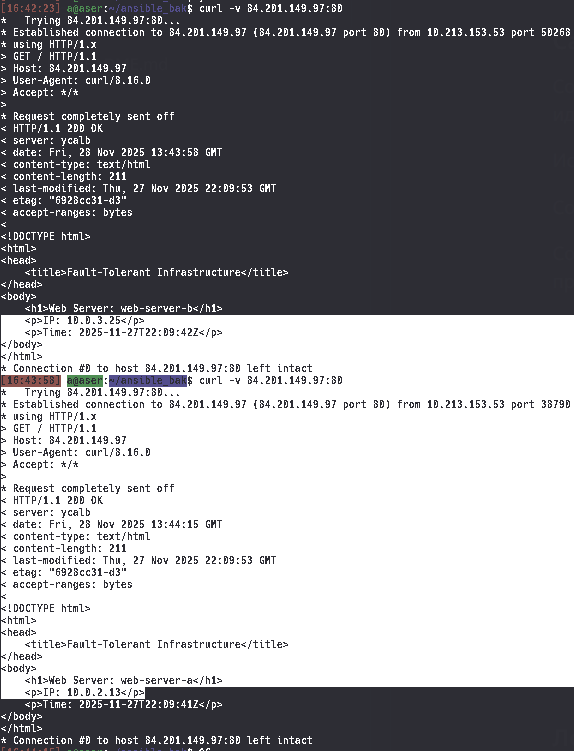

## **Мониторинг**
Развернута система мониторинга на основе Prometheus с Node Exporter и Nginx Log Exporter на веб-серверах. Настроена Grafana с дашбордами для отслеживания метрик Utilization, Saturation, Errors по CPU, RAM, дискам, сети и HTTP-метрик.

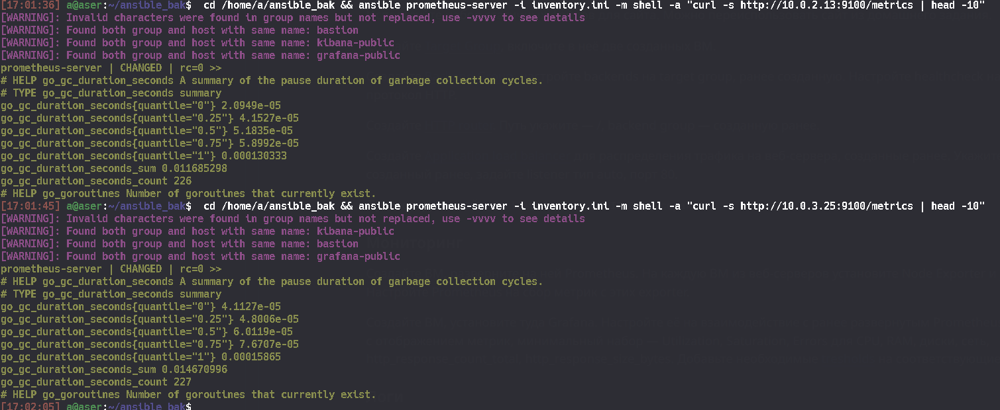

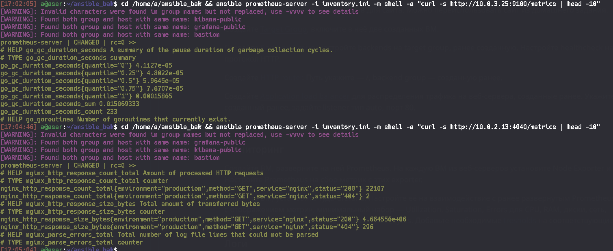

## **Логи**
Реализована система сбора и анализа логов на базе Elasticsearch. На веб-серверах установлен Filebeat для отправки access.log и error.log nginx в Elasticsearch. Настроена Kibana для визуализации и анализа логов.

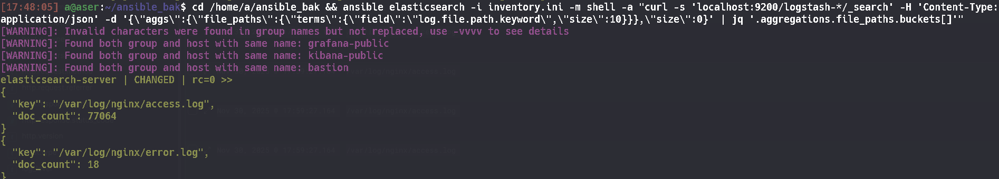

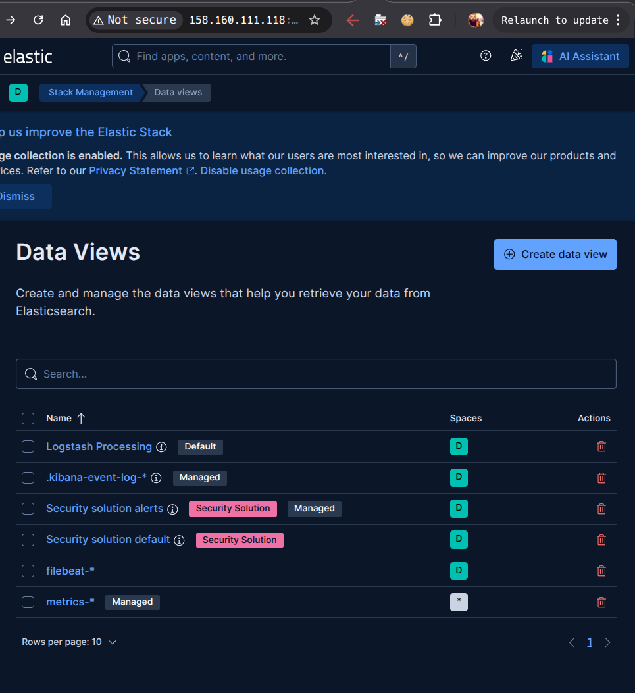

## **Сеть**
Спроектирована сетевая инфраструктура с разделением на публичные и приватные подсети. Настроены Security Groups для ограничения доступа к сервисам. Реализован bastion host для безопасного SSH-доступа ко всем хостам инфраструктуры.

### postgres-sg (enpsc6ck924q4vbvglk1)
| Rule ID | Direction | Port | Protocol | Source/Destination | Description |
|---|---|---|---|---|---|
| enpqduadg2k6ptmaloh1 | EGRESS | ALL | ANY | 0.0.0.0/0 | All outbound traffic |
| enp7vphokv1voo2sedmm | INGRESS | 6432 | TCP | 10.0.0.0/16 | PostgreSQL access from internal network |

### alb-sg (enpnd2up30hrbhmlio5k)
| Rule ID | Direction | Port | Protocol | Source/Destination | Description |
|---|---|---|---|---|---|
| enpqie46nqu9172k5eh3 | EGRESS | ALL | ANY | 0.0.0.0/0 | - |
| enpqoilh1u3hqnqvq6vd | INGRESS | 80 | TCP | 0.0.0.0/0 | - |
| enppr340cp8ld1jo76cu | INGRESS | 30080 | TCP | 198.18.235.0/24, 198.18.248.0/24 | - |

### bastion-sg (enpu27ijmidl5k0u3kdh)
| Rule ID | Direction | Port | Protocol | Source/Destination | Description |
|---|---|---|---|---|---|
| enp66mu5oniuatg7oer4 | EGRESS | ALL | ANY | 0.0.0.0/0 | - |
| enpsbi6koo63nm510ai0 | INGRESS | 22 | TCP | 0.0.0.0/0 | - |

### kibana-sg (enpr0vt6vk3huophng41)
| Rule ID | Direction | Port | Protocol | Source/Destination | Description |
|---|---|---|---|---|---|
| enphoa1p9b83dicangtn | EGRESS | ALL | ANY | 0.0.0.0/0 | - |
| enpdji82dnun3tpcurap | INGRESS | 5601 | TCP | 0.0.0.0/0 | - |
| enplcffbhmmgjr3o1su7 | INGRESS | 22 | TCP | enpu27ijmidl5k0u3kdh | - |

### grafana-sg (enpdkikl2la0jj2r7etb)
| Rule ID | Direction | Port | Protocol | Source/Destination | Description |
|---|---|---|---|---|---|
| enpil2eonmb3bc01vrva | EGRESS | ALL | ANY | 0.0.0.0/0 | - |
| enpsk7jqc90pbneknjrf | INGRESS | 3000 | TCP | 0.0.0.0/0 | - |
| enprtjahg7g4cc8ss7du | INGRESS | 22 | TCP | enpu27ijmidl5k0u3kdh | - |

### web-sg (enpnhlo5i3l70t9v7bla)
| Rule ID | Direction | Port | Protocol | Source/Destination | Description |
|---|---|---|---|---|---|
| enpl5i8dagdhhffvo1mu | EGRESS | ALL | ANY | 0.0.0.0/0 | - |
| enpschnp2tg5o35vr5jd | INGRESS | 9100 | TCP | enpg9ob6e5eo4buc3psc | - |
| enp95fq82uteu4cm733v | INGRESS | 80 | TCP | enpnd2up30hrbhmlio5k | - |
| enp22n11t12m4m52dnvb | INGRESS | 4040 | TCP | enpg9ob6e5eo4buc3psc | - |
| enps833s2bqe3jimgcs4 | INGRESS | 22 | TCP | enpu27ijmidl5k0u3kdh | - |

### prometheus-sg (enpg9ob6e5eo4buc3psc)
| Rule ID | Direction | Port | Protocol | Source/Destination | Description |
|---|---|---|---|---|---|
| enpl2nl57q7v74k7p4ps | EGRESS | ALL | ANY | 0.0.0.0/0 | - |
| enpkikumbavqjs1kk7pb | INGRESS | 22 | TCP | enpu27ijmidl5k0u3kdh | - |
| enpd5hultsboh0o2q35g | INGRESS | 9090 | TCP | enpdkikl2la0jj2r7etb | - |

### elasticsearch-sg (enpckdtb25sn5f2gqril)
| Rule ID | Direction | Port | Protocol | Source/Destination | Description |
|---|---|---|---|---|---|
| enpbn9479smbt15a7h5o | EGRESS | ALL | ANY | 0.0.0.0/0 | - |
| enpjkmhtfapck924lj6r | INGRESS | 5044 | TCP | enpnhlo5i3l70t9v7bla | - |
| enpr8hsc26t7qd6isv05 | INGRESS | 22 | TCP | enpu27ijmidl5k0u3kdh | - |
| enpoqurtqldp462allp3 | INGRESS | 9200 | TCP | enpr0vt6vk3huophng41 | - |
| enpt7bq28q8qbpkqo2k7 | INGRESS | 9200 | TCP | enpnhlo5i3l70t9v7bla | - |

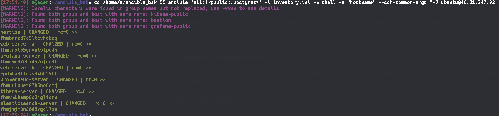

## **Резервное копирование**
Настроено автоматическое ежедневное создание snapshot дисков всех виртуальных машин с ограничением времени жизни в одну неделю. Обеспечена возможность быстрого восстановления системы из резервных копий.

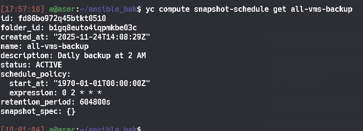

## **Дополнительно 1**
Реализовано альтернативное хранение данных Prometheus в Yandex Managed Service for PostgreSQL с настройкой кластера из двух нод и автоматическим failover.

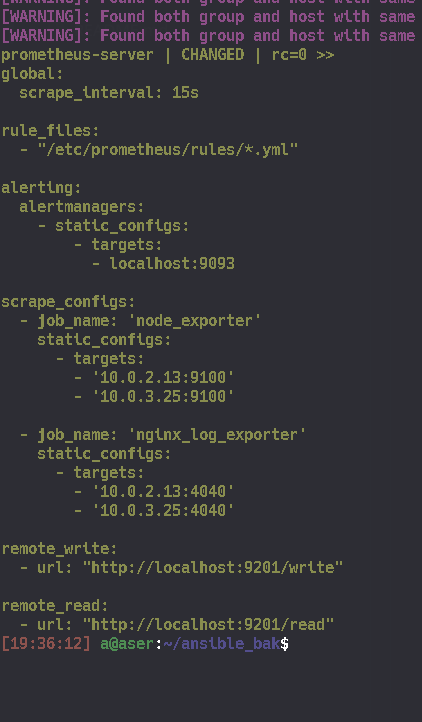

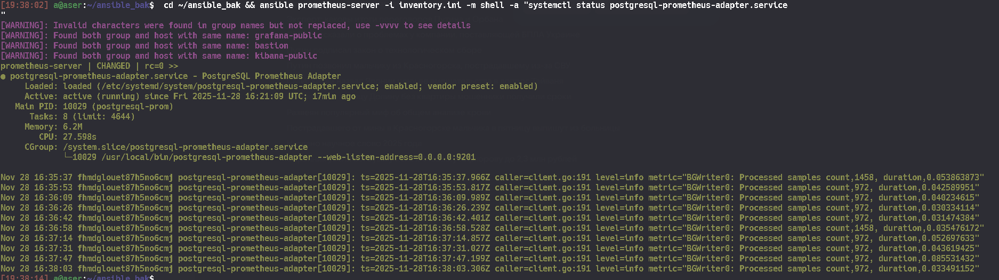

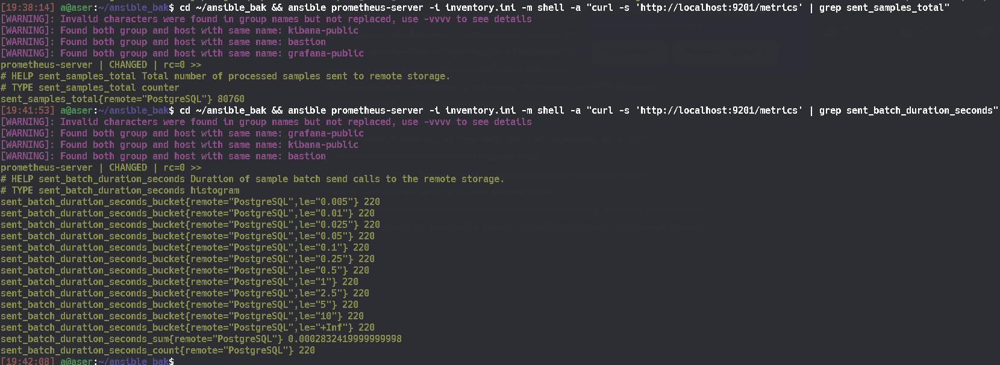

## **Дополнительно 2**
Настроена Instance Group с автоматическим горизонтальным масштабированием от 1 до 3 виртуальных машин на зону вместо статических целевых групп.

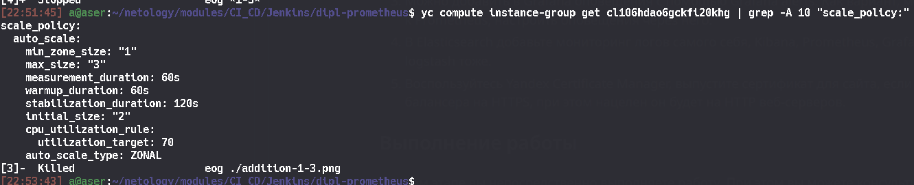

## **Дополнительно 3**
Добавлена система оповещений через Grafana alerts и Alertmanager для уведомлений о критических событиях в инфраструктуре.

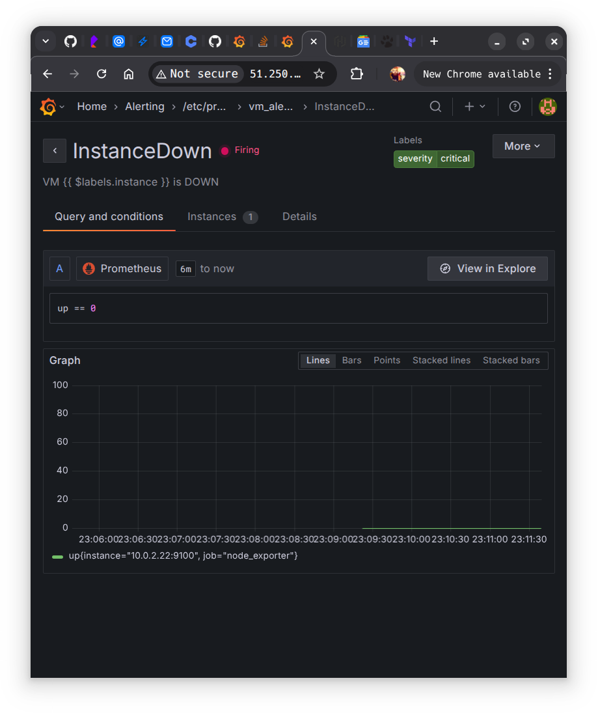

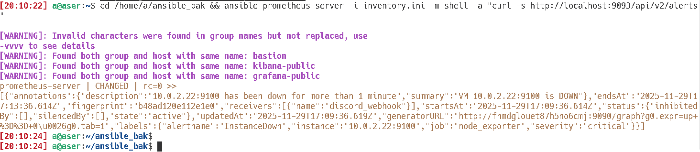

## **Дополнительно 4**
Расширен сбор логов для мониторинга Elasticsearch, Kibana, Prometheus и Grafana через Filebeat с возможностью использования Logstash.

[Пайплайн логов](https://3d6ios54vimrx2jivitn7i6wp40zaktv.lambda-url.eu-north-1.on.aws/)

## **Дополнительно 5**
Настроен HTTPS через Yandex Certificate Manager с выпуском SSL-сертификата для доменного имени и перенастройкой балансера на защищенное соединение.

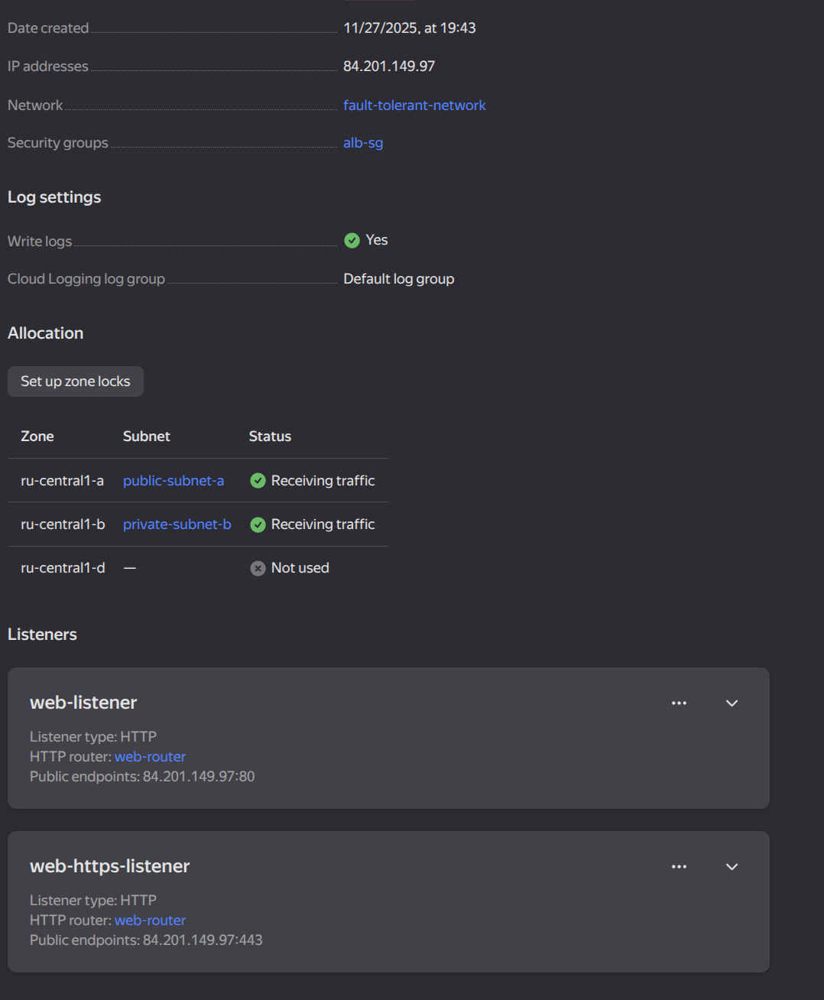

## **Адреса ресурсов**
Адреса всех ресурсов, у которых предполагается веб-страница:

- **Сайт**: http://84.201.149.97
- **Grafana**: http://158.160.112.169:3000 (admin/admin123)
- **Kibana**: http://158.160.111.118:5601

